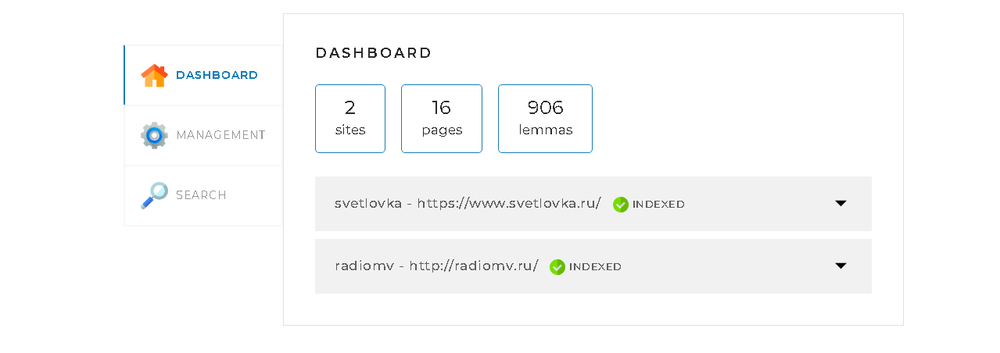
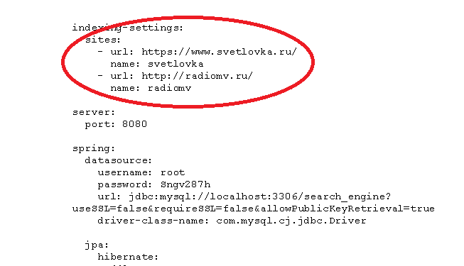

<h1 align="center">SearchEngine</h1>

## Описание

Поисковый движок представляет из себя Spring-приложение,
работающее с локально установленной базой данных MySQL,
имеющее простой веб-интерфейс и API, через который им можно
управлять и получать результаты поисковойзадачи по запросу.

## Принцип работы поискового движка

Перед заппуском приложения в конфигурационном файле application.yaml необходимо
задать адреса сайтов, по которым движок должен осуществлять поиск.

Поисковый движок самостоятельно обходит все страницы заданных сайтов и индексирует их, 
чтобы находить наиболее релевантные страницы по любому поисковому запросу.

## Меню
###Раздел DASHBOARD

Этот раздел открывается по умолчанию. Здесь представлена общая статисика по проиндексированным сайтам.
Также есть возможность посмотреть татистику отдельно по каждому сайту.

###Раздел MANAGER

В разделе MANAGER представлено две функции: 
индексация всех сайтов, указанных в файле конфигурации 
(запускается кнопкой START INDEXING)
и индексация отдельной страницы (необходимо внести в поле адрес 
страницы и нажать кнопку ADD/UPDATE)

###Раздел SEARCH

Используется для поиска страниц согласно поисковому запросу. 
Поиск может осуществляться как по всем сайтам, указанным в 
конфигурационном файле, так и по отдельному сайту.

Выбираем сайт из списка либо All sites, если необходимо произвести поиск
по всем сайтам.

В поле вводим слова запроса, по которым будет осуществлен поиск, 
и нажимаем Search.

Результат выводится с учетом релевантности найденых страниц.

## Технологии в проекте

В проекте для хранения данных реализована база данных на основе MySQL. Взаимодействие 
приложения с базой данных осуществлено с помощью технологии Hibernate.

Обработка запросов пользователя реализована с помощью технологии API.